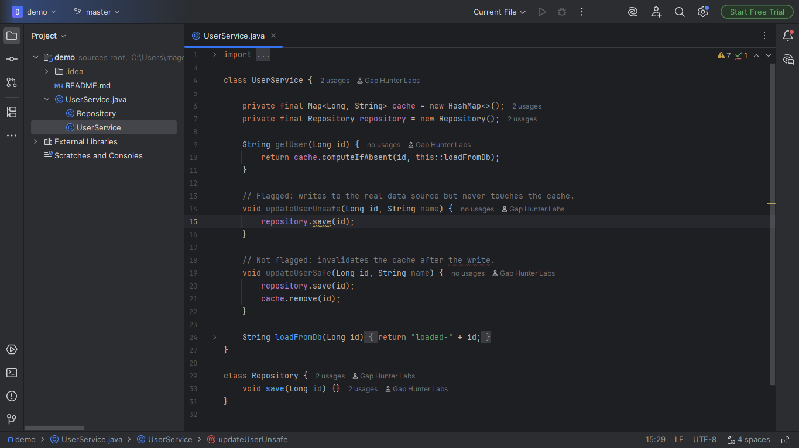
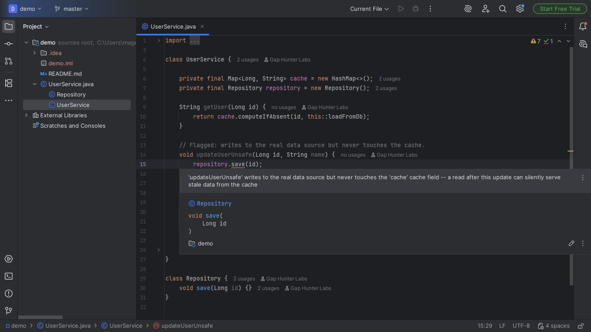

# Cache-Invalidation Companion

Warning on a `.save(...)` call inside a method whose class also has a
hand-rolled `Map`-backed cache field (populated by a
`computeIfAbsent`/manual `containsKey`+`put` "get-or-compute" pattern),
when that method never touches the cache field.

## Screenshots





## Why it exists

Stale data served after a real update -- a silent inconsistency
between what's written and what's read. No Marketplace plugin found
dedicated to hand-rolled cache invalidation gaps, outside the
`@Cacheable` ecosystem (which already has its own declarative
invalidation mechanism).

## Why built this way

"The same data source" is inferred heuristically: the mutator method
must never mention the cache field's name at all in its own body. A
method that DOES reference the field somewhere (even a `.remove(...)`
you'd expect) is assumed to already handle invalidation correctly --
this plugin only flags the case where the field is never touched at
all.

## v0.1 scope — stated honestly, not exhaustively

Only a hand-rolled cache with `Map` as the backing structure inside a
SINGLE class -- never covers `@Cacheable`/Caffeine/Redis as an
external cache. A real risk of false positives if the "never mentions
the field" heuristic is too loose -- an honestly-acknowledged limit,
not a claim of perfect precision.

## Usage

Open any Java file with a class that has both a hand-rolled `Map`
cache and a `.save(...)` call in a different method. A method that
writes without touching the cache shows a warning.

## Enterprise / Team Licensing

Need enterprise features, custom rules, or team licensing? Contact us at
**gaphunterlabs@gmail.com**.

## Development

```
./gradlew test           # unit tests
./gradlew buildPlugin    # generates build/distributions/*.zip
./gradlew verifyPlugin   # checks compatibility against real IDEs
```

## License

Apache-2.0. See `LICENSE`.
